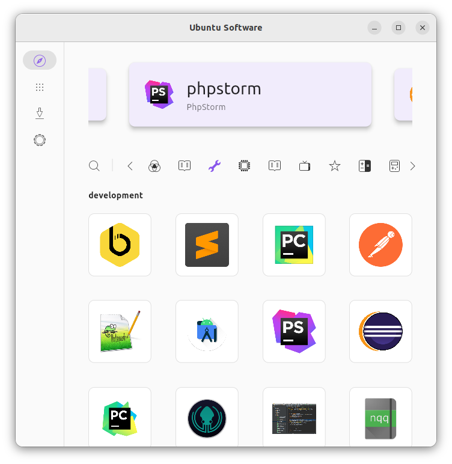

# Unofficial Ubuntu Store Flutter - WIP

An alternative software store for the Ubuntu Desktop made with Flutter.



## First goals

- [ ] Great UX
- [X] Adaptive Layout
- [X] Snap support (https://github.com/canonical/snapd.dart)
  - [X] install
  - [X] search
  - [X] remove
  - [X] filter for sections
  - [ ] refresh
  - [ ] switch channels
- [ ] Firmware support (https://github.com/canonical/fwupd.dart & https://github.com/canonical/firmware-updater)
- [ ] deb support (https://github.com/robert-ancell/dpkg.dart)

## Optional long term goals

- [ ]  flatpak support


## Build

### Install flutter

```bash
sudo apt install git curl cmake meson make clang libgtk-3-dev pkg-config
mkdir ~/development
cd ~/development
git clone https://github.com/flutter/flutter.git -b master
echo 'export PATH="$PATH:$HOME/development/flutter/bin"' >> ~/.bashrc
source ~/.bashrc
```

### run

```
flutter run
```

or press the run icon in vscode.