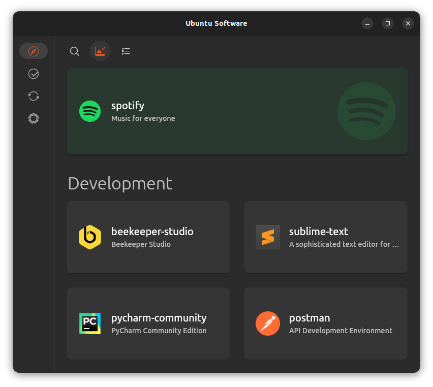

# Unofficial Ubuntu Store Flutter - WIP

An alternative software store for the Ubuntu Desktop made with Flutter.




## Goals

- [X] Great UX
- [X] Fast
- [X] Adaptive Layout
- [X] Snap support (https://github.com/canonical/snapd.dart)
  - [X] install
  - [X] search
  - [X] remove
  - [X] filter for sections
  - [X] refresh
  - [X] switch channels
  - [ ] manage plugs and permissions
- [ ] deb support (https://github.com/canonical/packagekit.dart)
  - [ ] install from file-explorer
  - [ ] remove

## Firmware updater

For the firmware updates the flutter linux desktop, yaru-designed application [firmware-updater](https://github.com/canonical/firmware-updater) is recommended


## Build

### Install flutter

```bash
sudo apt install git curl cmake meson make clang libgtk-3-dev pkg-config
mkdir ~/development
cd ~/development
git clone https://github.com/flutter/flutter.git -b stable
echo 'export PATH="$PATH:$HOME/development/flutter/bin"' >> ~/.bashrc
source ~/.bashrc
```

### run

```
flutter run
```

or press the run icon in vscode.